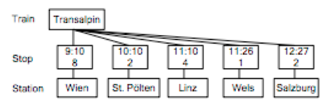

# 405-Zugfahrplan
Implementiere ein Klassensystem für den Aufbau und die Abfrage eines Zugfahrplans.


* Ein Zugfahrplan (Klasse Timetable) besteht aus mehreren Objekten von:
  * Bahnhöfen (Klasse Station), Zügen (Klasse Train) und Stopps (Klasse Stop)
* Ein Zug hat einen (eindeutigen) Namen und eine Reihe von Stopps (aufsteigend nach der Zeit sortiert)
* Ein Stop gehört zu einem Zug und hat einen Bahnsteig, eine Zeit, sowie einen Bahnhof
* Die Klasse Train stellt folgende Operationen zur Verfügung:
  * Anfügen eines Stopps an einem bestimmten Bahnhof auf einem bestimmten Bahnsteig und zu einer gegebene  Zeit  
  * Zugriff auf den ersten und letzten Stopp, bzw. auf den Quell- und Zielbahnhof
  * Zugriff auf alle Stopps des Zugs in aufsteigender zeitlicher Reihenfolge
  * Zugriff auf die Menge der Stopps ab einem gegebenen Bahnhof (der Name des Bahnhofs wird als Parameter übergeben)



Teste die Klassen indem du einen Zugfahrplan erstellst und befüllst. Gib alle Züge mit folgender Formatierung aus:


```  		Transalpin (Wien  -  Salzburg)
  			9:10 Wien (8)
  			10:10 St. Pölten (2)
  			....
  		Lernen auf Rädern (Salzburg– Wels)
  			8:50 Wien (7)
  			....
```
